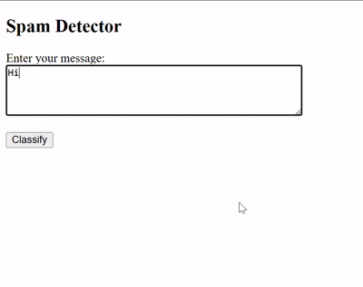

# SMS Spam Detector

A machine learning-based web application that detects whether a given SMS message is spam or not. The application uses a Support Vector Machine (SVM) classifier with TfidfVectorization to make predictions.

## Demonstration



## Features

- Real-time SMS spam detection
- Web-based interface for easy interaction
- Probability scores for predictions
- Built with Flask and scikit-learn

## Prerequisites

Before running this project, make sure you have the following installed:

- Python 3.7 or higher
- pip (Python package installer)

## Installation

1. Clone this repository:
```bash
git clone https://github.com/Abhay-Mmmm/SMS-Spam-Detector.git
cd SMS-Spam-Detector
```

2. Create a virtual environment (recommended):
```bash
# On Windows
python -m venv venv
venv\Scripts\activate

# On macOS/Linux
python3 -m venv venv
source venv/bin/activate
```

3. Install the required packages:
```bash
pip install flask pandas scikit-learn
```

## Project Structure

```
SMS-Spam-Detector/
├── app.py              # Main Flask application
├── templates/          # HTML templates
├── spam.csv           # Training dataset
├── test_score.csv     # Test dataset
└── Detector_Model.ipynb # Jupyter notebook for model development
```

## Running the Application

1. Make sure you're in the project directory and your virtual environment is activated.

2. Run the Flask application:
```bash
python app.py
```

3. Open your web browser and navigate to:
```
http://localhost:5000 (Default)
```

## Usage

1. Enter an SMS message in the text input field
2. Click the "Classify" button
3. The application will display whether the message is spam or not, along with probability scores

## Model Details

- The model uses a Support Vector Machine (SVM) classifier with a linear kernel
- Text is vectorized using TF-IDF (Term Frequency-Inverse Document Frequency)
- The model is trained on a dataset of 4,400 SMS messages
- The remaining messages are used for testing

## Contributing

Feel free to submit issues and enhancement requests!

## License

This project is licensed under the MIT License.